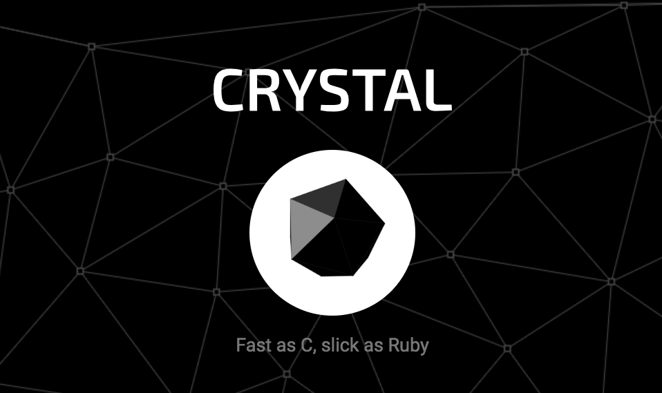
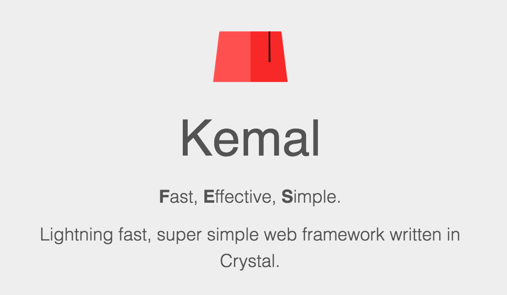

# CRYSTAL_KEMAL

## What is Crystal?
Crystal started out as an experiment to see what compiled Ruby would look like. And now Crystal is a programming language that aims to be friendly for both humans and computers alike - make developers enjoy writing code, and make code run as efficiently as it can. Statically typed, compiled language with a really heavy type inference to make it feel as scripting. 

Crystal compiles down to efficient code, which means Crystal programs are much faster than Ruby programs.

Crystal don’t work on Windows. So you have to use a Mac or a Linux based system.

Use the Crystal extension to provide support for the Crystal programming language.



## What is Kemal?
Kemal is the standard the facto web framework for Crystal, lightning fast and super simple.




## How to install
1. Install Crystal 
```
brew install crystal-lang
```
2. Create your application
```
crystal init app your_app_name
cd your_app
```
3. Add kemal to the shard.yml file as a dependency.
```
dependencies:
  kemal:
    github: kemalcr/kemal
    branch: master
```
4. Run shards to get dependencies:
```
shards install
```