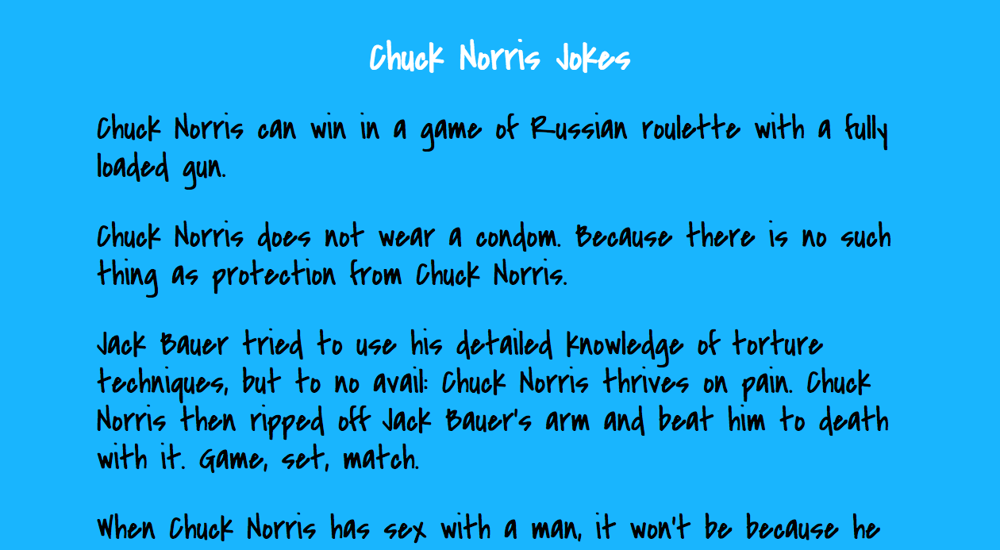

# CRYSTAL_KEMAL

## What is Crystal?
Crystal started out as an experiment to see what compiled Ruby would look like. And now Crystal is a programming language that aims to be friendly for both humans and computers alike - make developers enjoy writing code, and make code run as efficiently as it can. Statically typed, compiled language with a really heavy type inference to make it feel as scripting. 

Crystal compiles down to efficient code, which means Crystal programs are much faster than Ruby programs.

Crystal don’t work on Windows. So you have to use a Mac or a Linux based system.

Use the Crystal extension to provide support for the Crystal programming language.


## What is Kemal?
Kemal is the standard de facto web framework for Crystal, lightning fast and super simple.

Some of the cool features of Kemal are:
- Support all REST verbs
- Websocket support
- Request/Response context, easy parameter handling
- Built-in and easily extensible middlewares
- Built-in JSON support
- Built-in static file serving
- Built-in view templating via ECR

## Benchmarks


## Creating a simple app with Crystal programming language and Kemal framework





## How to install
1. First, we need to install Crystal 
```diff
brew install crystal-lang
```
2. Then,we can start to create a new application
```diff
crystal init app your_app_name
cd your_app
```
3. Add kemal to the shard.yml file as a dependency.
```diff
dependencies:
  kemal:
    github: kemalcr/kemal
    branch: master
```
4. Run shards to get dependencies:
```diff
shards install
```
Now we get both Crystal and Kemal, let's see how to create a hello world app

## First hello world app by using crystal 
In src/your_app_name put these codes
```diff
require "kemal"

get "/" do
  "Hello World!"
end

Kemal.run
```
* Run the app
```diff
crystal run src/your_app.cr
```
* You should see some logs like these:
```diff
[development] Kemal is ready to lead at http://0.0.0.0:3000
```
* Go to localhost:3000
You should be able to see "Hello World!" on your browser

### HTTP Parameters
Kemal allows you to use variables in your route path as placeholders for passing data. To access URL parameters, you use env.params.url.

You can create something like this as your route

```diff
get "/:name" do |env|
  name = env.params.url["name"].capitalize
  puts "Hello back to #{name}"
end
```
### Templates
You can use ERB-like built-in ECR to render dynamic views.
In your routes.cr, you can directly render that ECR file.
So we can modify the codes we just wrote and render the template like this
```diff
get "/:name" do |env|
  name = env.params.url["name"].capitalize
  render "src/views/hello.ecr"
end
```
Then, we create a views folder under src

### Request API
In Kemal, if you want to request API you have to require some modules first
```diff
require "http/client"
require "json"
require "./crystal_testing/*"
require "kemal"
```
Here we used the Chuck Norris jokes API to create a sample app.
We touch a new chucky.cr in src folder and create a new class Chucky
```diff
class Chucky
  def get_joke
    response = HTTP::Client.get "http://api.icndb.com/jokes/random/1"
    JSON.parse(response.body)["value"]
  end
```
Crystal has built-in with an HTTP client and JSON parser and that's how we request the API 
and set up the response data.

Here are the complete code we have in the end
```diff
require "http/client"
require "json"
require "./crystal_testing/*"
require "kemal"

module Joking

class Chucky
  def get_joke
    response = HTTP::Client.get "http://api.icndb.com/jokes/random/1"
    JSON.parse(response.body)["value"]
  end
  def get_all
    response = HTTP::Client.get "http://api.icndb.com/jokes/random/100"
    JSON.parse(response.body)["value"]
  end
end
  
get "/jokes" do 
  c = Chucky.new
  jokes = c.get_joke
  render "src/views/jokes.ecr"
end

get "/jokes/all" do 
  c = Chucky.new
  jokes = c.get_all
  render "src/views/alljokes.ecr"
end

Kemal.run
end
```

### CSS Styling 
We create a public directory at the root of our app and inside we can have our css directory with our stylesheets inside.

We link our stylesheet and google fonts links at the top of our ecr views pages.
```diff
<link href="/css/style.css" rel="stylesheet">
<link href="https://fonts.googleapis.com/css?family=Covered+By+Your+Grace" rel="stylesheet">
<link href="https://fonts.googleapis.com/css?family=Roboto" rel="stylesheet">
```

Below are some of the classes we used in our HTML elements to target our css styles.

```diff
<link href="/css/style.css" rel="stylesheet">
<link href="https://fonts.googleapis.com/css?family=Covered+By+Your+Grace" rel="stylesheet">
<link href="https://fonts.googleapis.com/css?family=Roboto" rel="stylesheet">

<div class="main-jokes-container">
    <div class="jokes-page">
        <h1 class="headline"><a href='/jokes'>Chuck Norris Jokes</a></h1>
    </div>
    <div class="all-jokes">
        <ul>
            <% jokes.each do |joke| %>
                <li><%= joke["joke"] %> </li>
            <%end%>
        </ul>
    </div>
</div>
```


